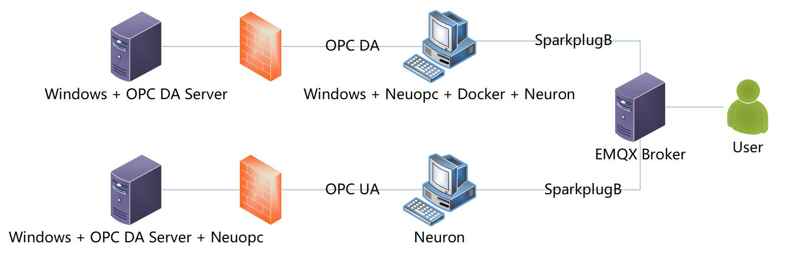
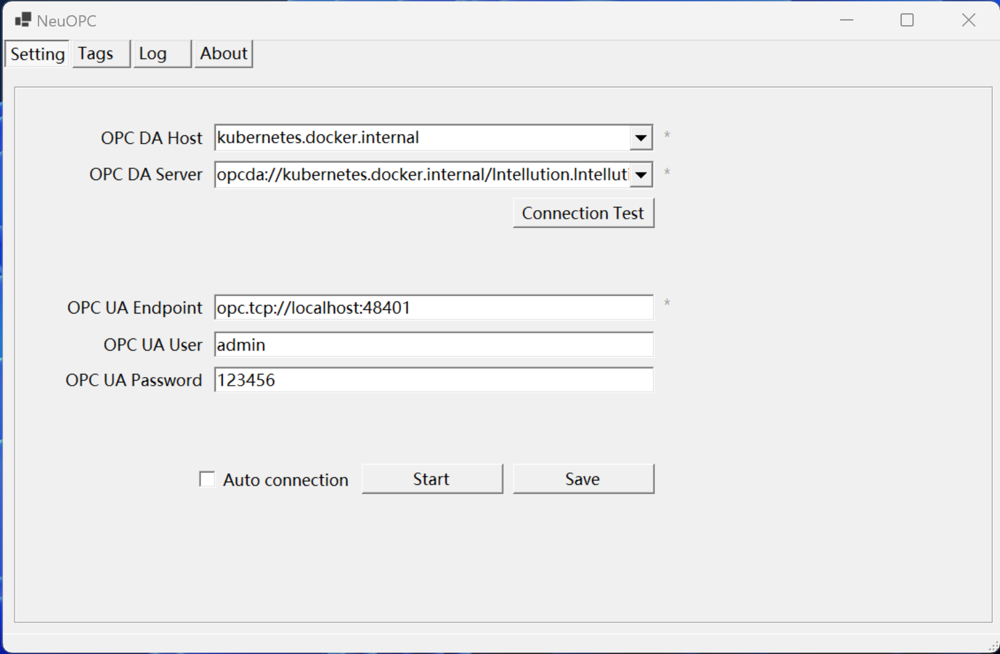

# NeuOPC: A implementation of opcshift based on .net core

## Overview
This is a program that converts the OPC DA protocol to the OPC UA protocol for access.

## Build
1. Clone this github repository.

2. Install Visual Studio 2022 and add .Net desktop development components. Open the neuopc.sln file with Visual Studio 2022.

3. Find the file opc-net-api-sample-clients-2.01.109.57-20220427.zip and extract it, then find NuGetPackages in the directory.

4. Add the following local neuget packages to the DaClient subproject, OpcComRcw.2.1.109.nupkg, OpcNetApi.2.1.109.nupkg, OpcNetApi.Com.2.1.109.nupkg, OpcNetApi.Xml.2.1.109.nupkg.

5. Add the following local neuget packages to the neuclient subproject, OpcComRcw.2.1.109.nupkg, OpcNetApi.2.1.109.nupkg, OpcNetApi.Com.2.1.109.nupkg.

6. Add the following remote neuget packages to the neuopc subproject, Dapper, Serilog, Serilog.Sinks.File, System.Data.SQLite.

7. Add the OPCFoundation.NetStandard.Opc.Ua.Server package to the neuserver subproject.

The SDK for OPC DA requires the solution to be compiled on an x86 platform, .Net Framework may subsequently need to be migrated to version 4.8 to ensure that the OPC DA interface is called correctly.

## Quick Start

Run with Debug in Visual Studio, we will get the following GUI program, for more information please visit [Overview](https://docs.emqx.com/en/neuronex/latest/configuration/south-devices/opc-da/overview.html)

